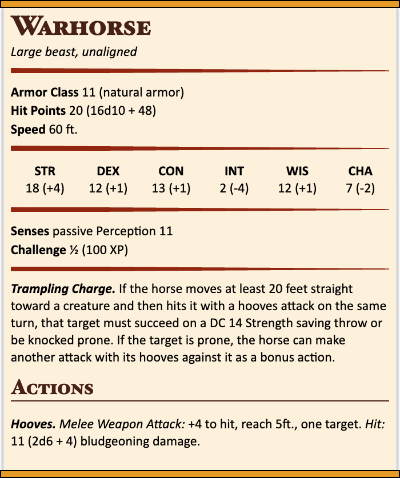

# &lt;vellum-monster&gt; [](https://travis-ci.org/grislyeye/vellum-monster) [](https://snyk.io/test/github/grislyeye/vellum-monster?targetFile=package.json)

Web component for displaying monster stat blocks for the fifth edition of the world's most popular table-top roleplaying game. Based on [Val Markovic's Statblock5e](https://valloric.github.io/statblock5e/) but with the following, additional features:

  * Simpler (just one import vs 5)
  * Theme-able
  * Automatically calculate values (average hit points and challenge rating)

To install:

```sh
npm install --save vellum-monster
```

You can also use the CDN:

```html
<script src="https://cdn.jsdelivr.net/npm/vellum-monster@1.0.2/dist/vellum-monster.min.js"></script>
```



The above stat block is written as follows:

```html
<vellum-monster
  id="warhorse"
  class="official"
  name="Warhorse"
  size="Large"
  type="beast"
  alignment="unaligned"
  ac="11"
  armor="natural armor"
  hp="20"
  hit-die="16d10 + 48"
  speeds='["60 ft."]'
  cr="½"

  str="18"
  dex="12"
  con="13"
  int="2"
  wis="12"
  cha="7"

  senses='["passive Perception 11"]'
  traits='[
    {
      "name": "Trampling Charge",
      "description": "If the horse moves at least 20 feet straight toward a creature and then hits it with a hooves attack on the same turn, that target must succeed on a DC 14 Strength saving throw or be knocked prone. If the target is prone, the horse can make another attack with its hooves against it as a bonus action."
    }
  ]'
  actions='[
    {
      "name": "Hooves",
      "type": "melee-attack",
      "bonus": "+4",
      "reach": "5ft.",
      "target": "one target",
      "damage": "2d6 + 4",
      "damageType": "bludgeoning"
    }
  ]'
>
</vellum-monster>
```

This module also includes a theme to give your stat blocks a more "official" look. Simply add the following to your HTML file `head` element:

```html
<link rel="stylesheet" type="text/css" href="vellum-monster/themes/official/style.css">
```

### Calculating Challenge Rating

If you do not provide the challenge rating for your monster, `<vellum-monster>` will attempt to automatically calculate and fill this value in for you, based on armor class, hit points, damage and attack bonus.

Traits, actions, reactions and legendary actions can adjust the effective value of these stats when calculating challenge rating. Each of these objects of can declare a `hpAdjustment`, `acAdjustment`, `damageAdjustment` or `attackAdjustment` which can increase or decrease the effective hit points, armor class, damage or attack bonus when calculating CR.

## Custom Themes

To create a custom theme for your stat blocks using something like the following CSS:

```css
html vellum-monster.my-theme,
html vellum-stat-block.my-theme {

  // custom styles here

}
```

You can then add standard CSS. The `<vellum-monster>` and `<vellum-monster>` support the following custom CSS properties:

| Property                               | Description
| -------------------------------------- | ---
| `--stat-block-width`                   | Describes the width property for the stat block, as per the [CSS `width` property](https://developer.mozilla.org/en/docs/Web/CSS/width).
| ` --stat-block-background`             | Describes the background property for the stat block body, as per the [CSS `background` property](https://developer.mozilla.org/en/docs/Web/CSS/background).
| `--stat-block-bar-border`              | Describes the border property for top and bottom stat block bars, as per the [CSS `border` property](https://developer.mozilla.org/en/docs/Web/CSS/border).
| ` --stat-block-bar-background`         | Describes the background property for top and bottom stat block bars, as per the [CSS `background` property](https://developer.mozilla.org/en/docs/Web/CSS/background).
| `--stat-block-border-color`            | The [colour](https://developer.mozilla.org/en-US/docs/Web/CSS/color) for the stat block borders on the right and left.
| `--stat-block-header-color`            | The [colour](https://developer.mozilla.org/en-US/docs/Web/CSS/color) of the section headings and stat block header text.
| `--stat-block-heading-font-family`     | The [font-family](https://developer.mozilla.org/en-US/docs/Web/CSS/font-family) of the section headings and stat block header text.
| `--stat-block-divider-color`           | The [colour](https://developer.mozilla.org/en-US/docs/Web/CSS/color) of the divider between sections of the stat block.
| `--stat-block-two-column-width`        | If the `two-column` class is applied to the stat block, this defines the width of the wider stat block.
| `--stat-block-two-column-column-width` | If the `two-column` class is applied to the stat block, this defines the width of the width of the columns within the stat block.

See the [official theme](https://github.com/grislyeye/vellum-monster/blob/master/themes/official/style.css) for an example of how to style your stat blocks

## Custom Stat Blocks

The `<vellum-stat-block>` element allows you to create custom stat-blocks layouts. This could be for information that doesn't conform to the stand monster stat block, such as [location stat blocks](https://imgur.com/a/aIVfv). Or to represent non-standard information the `<vellum-monster>` element doesn't yet support.

For example:

```html
<vellum-stat-block
  class="official"
  name="Custom Stat Block"
  description="Demonstration of custom stat blocks"
>

  <vellum-stat name="Test Stat 1">Test Stat Value 1</vellum-stat>

  <vellum-stat-block-divider></vellum-stat-block-divider>

  <vellum-stat name="Test Stat 2">Test Stat Value 2</vellum-stat>

</vellum-monster>
```

**Note:** Users are encouraged `<vellum-monster>` element for monster descriptions wherever possible, and [raise bugs](https://github.com/grislyeye/vellum-stat-block/issues/new) where it doesn't support what you want to do. Rather than fallback to the `<vellum-stat-block>`.

## NPC Stat Blocks

The `<vellum-npc>` element allows you to display a NPC in more roleplaying terms and is a work in progress.

## Hacking

Requirements:

  * [Node.js](http://nodejs.org/)

To set-up your environment execute:

    $ npm install

To run demo page:

    $ npm run start

To run tests execute:

    $ npm test

To run the tests you need to have Java 8 installed.

## Rights

This software is copyrighted by Ricardo Gladwell and Val Markovic 2014-2018. It is licensed under the [Apache License, Version 2.0](LICENSE.txt). All monster statistics are Open Game Content and licensed under the [Open Gaming License](OGL.txt).
